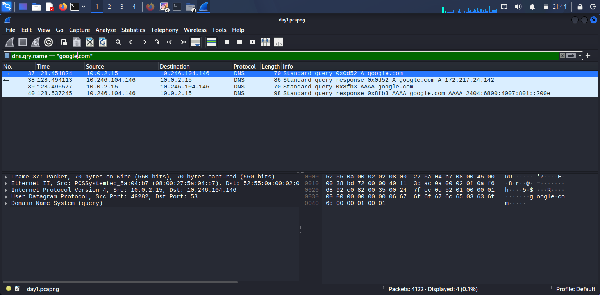
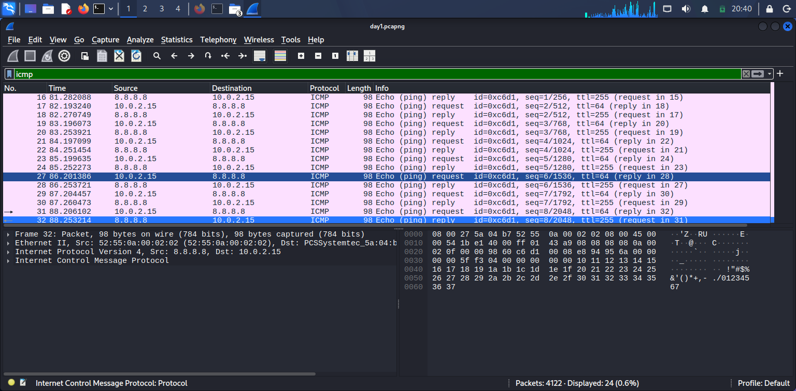
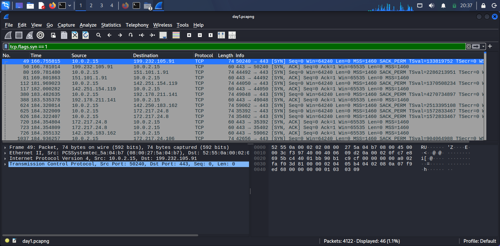
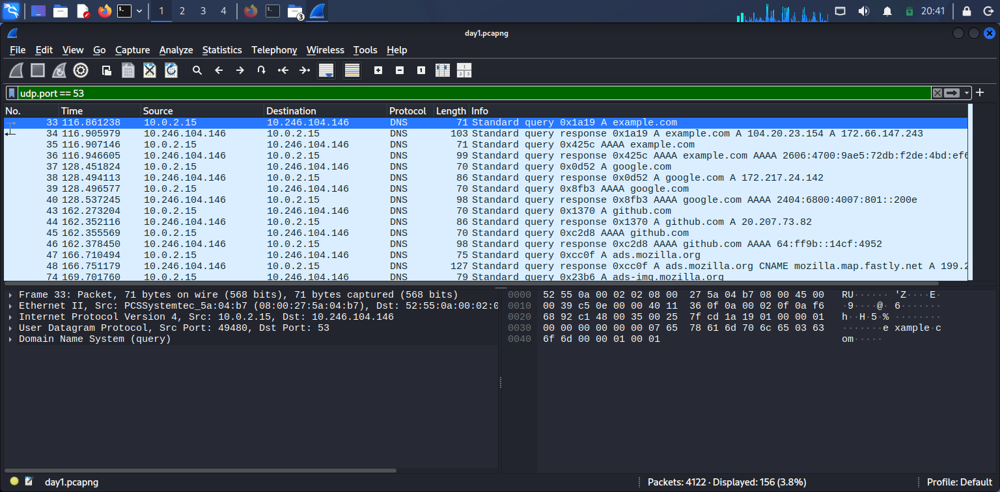
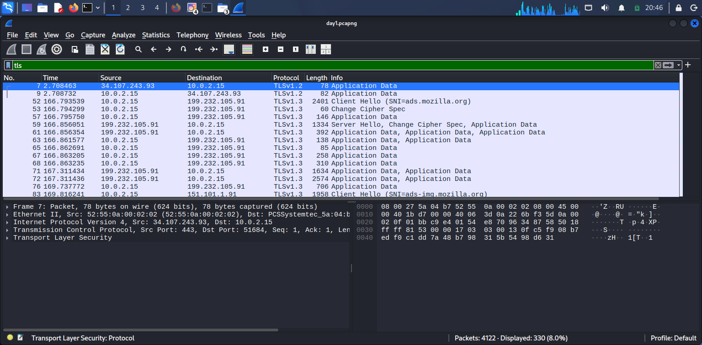

# Day 1 – Wireshark Network Traffic Analysis

## Objective

The objective of this lab was to capture live network traffic and analyze common network protocols using Wireshark. The analysis focused on DNS, TCP, UDP, ICMP, and TLS traffic.

## Tools Used

* Kali Linux
* Wireshark
* tcpdump
* Firefox
* Terminal utilities (`ping`, `nslookup`)

## Network Information

* **Network Interface:** eth0
* **Local IP Address:** 10.0.2.15
* **Default Gateway:** 10.0.2.2
* **Capture File:** day1.pcapng

## Packet Capture

Live network traffic was captured from the `eth0` interface using tcpdump:

```bash
sudo tcpdump -i eth0 -w ~/day1.pcapng
```

During the capture, DNS, ICMP, and web traffic were generated using terminal commands and Firefox.

---

## 1. DNS Analysis

**Wireshark Filter:**

```text
dns.qry.name == "google.com"
```

### Findings

* **Source IP:** 10.0.2.15
* **Destination/DNS Server:** 10.246.104.146
* **Source Port:** 49282
* **Destination Port:** 53
* **Domain Queried:** google.com
* **Query Type:** A
* **Resolved IPv4 Address:** 172.217.24.142

An AAAA query was also observed for IPv6 resolution.

### Observation

The host `10.0.2.15` sent a DNS request to `10.246.104.146` to resolve `google.com`. The DNS server returned `172.217.24.142` for the IPv4 A-record query.



---

## 2. ICMP Analysis

**Wireshark Filter:**

```text
icmp
```

### Findings

* **Source:** 10.0.2.15
* **Destination:** 8.8.8.8
* **Protocol:** ICMP
* **Request:** Echo (ping) Request
* **Response:** Echo (ping) Reply

### Observation

The local host sent ICMP Echo Request packets to `8.8.8.8` and received corresponding Echo Reply packets. This confirmed network connectivity between the host and the destination.



---

## 3. TCP Analysis

**Wireshark Filter:**

```text
tcp.flags.syn == 1
```

### Findings

One observed TCP connection included:

* **Source IP:** 10.0.2.15
* **Destination IP:** 199.232.105.91
* **Source Port:** 50240
* **Destination Port:** 443

The packet capture showed:

```text
10.0.2.15:50240 → 199.232.105.91:443  [SYN]
199.232.105.91:443 → 10.0.2.15:50240  [SYN, ACK]
```

### Observation

The SYN packet shows the client attempting to establish a TCP connection with the remote server. The server responded with SYN-ACK, indicating that it accepted the connection request.

The filter used for this screenshot displays packets with the SYN flag set, so the final ACK of the TCP three-way handshake is not shown.



---

## 4. UDP Analysis

**Wireshark Filter:**

```text
udp.port == 53
```

### Findings

DNS communication was observed using UDP port 53.

Example:

* **Source IP:** 10.0.2.15
* **Destination:** 10.246.104.146
* **Source Port:** 49480
* **Destination Port:** 53

### Observation

The capture demonstrated that DNS queries and responses can be transported using UDP. Unlike TCP, UDP does not establish a connection using a three-way handshake before transmitting data.



---

## 5. TLS/HTTPS Analysis

**Wireshark Filter:**

```text
tls
```

### Findings

TLS 1.3 traffic was observed while browsing the web with Firefox.

The capture included:

* TLS Client Hello
* TLS Server Hello
* TLS Application Data
* TLS 1.3 traffic
* SNI information such as `ads.mozilla.org`

### Observation

The web traffic was protected using TLS encryption. Although Wireshark could identify connection metadata and TLS handshake information, the actual HTTPS application data appeared as encrypted Application Data rather than readable HTTP content.

This explains why normal HTTP traffic was not observed during modern HTTPS web browsing.



---

## What I Learned

1. How to capture live network traffic using tcpdump.
2. How to open and analyze packet captures using Wireshark.
3. How DNS resolves domain names to IP addresses.
4. How to identify DNS queries and responses.
5. How ICMP Echo Request and Echo Reply packets work.
6. How TCP SYN and SYN-ACK packets are used during connection establishment.
7. How DNS traffic can operate over UDP port 53.
8. How HTTPS traffic is protected using TLS encryption.
9. How Wireshark display filters help isolate specific protocols during network investigations.

## Conclusion

This lab provided hands-on experience capturing and analyzing network traffic. By examining DNS, ICMP, TCP, UDP, and TLS packets, I gained a better understanding of how common network protocols behave and how packet analysis can be used during security monitoring and network investigations.

